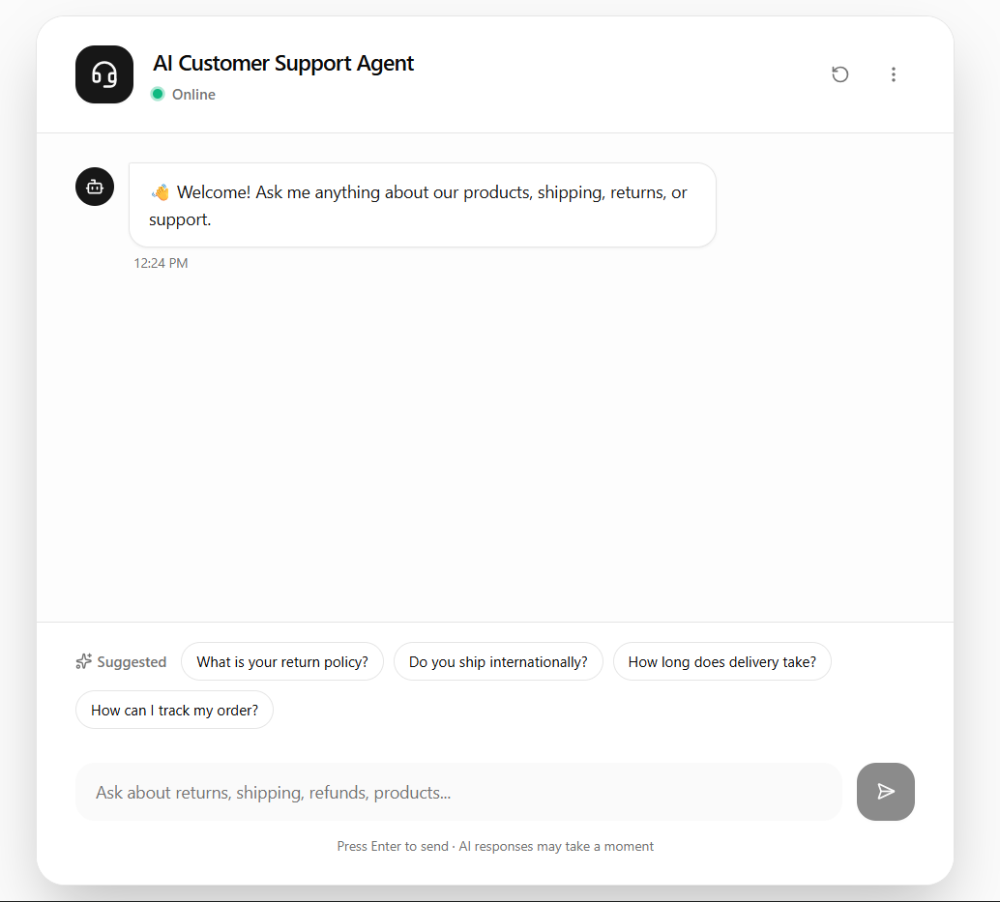

# 💬 Spur - AI Live Chat Agent

A full-stack, production-ready AI customer support agent built for the **Spur Founding Full-Stack Engineer** assignment. 

This project simulates a live e-commerce chat widget where an AI agent reliably answers domain-specific questions (shipping, returns, etc.) while maintaining conversational context, handling errors gracefully, and persisting history to a database.

---

## 🚀 Tech Stack

### Frontend
* **Framework:** React (Vite) + TypeScript
* **Styling:** Tailwind CSS + Shadcn UI + Lucide Icons
* **Data Fetching:** Axios

### Backend
* **Runtime:** Node.js + Express + TypeScript
* **Validation:** Zod
* **AI:** Anthropic API (`claude-opus-4-1`)
* **Database:** PostgreSQL (Hosted on [Neon](https://neon.tech))
* **ORM:** Prisma + `@neondatabase/serverless` (WebSocket driver)

---

## ✨ Core Features

* **Contextual Memory:** Passes the last 10 messages to the LLM to remember conversational history without breaking token limits.
* **Domain Knowledge:** Seeded with e-commerce FAQs (Shipping, Returns, Hours) via system prompts.
* **Robust Guardrails:** Strict Zod input validation (handles `null` and limits) and graceful LLM fallback messages.
* **Serverless-Optimized:** Uses Neon's WebSocket driver to maintain persistent DB connections, eliminating cold-start TCP drops.
* **Persistent Sessions:** History is saved to PostgreSQL and tied to a unique `sessionId`.

---

## 🛠️ Local Setup

### 1. Backend Setup
```bash
cd backend
npm install
```

Create a `.env` file:

```env
DATABASE_URL="postgresql://<user>:<password>@<host>.aws.neon.tech/neondb?sslmode=require"
ANTHROPIC_API_KEY="your_api_key"
PORT=3001
```

Sync DB and start:

```bash
npx prisma db push
npx prisma generate
npm run dev
```

### 2. Frontend Setup

```bash
cd frontend
npm install
```

Create a `.env` file:

```env
VITE_BACKEND_URL="http://localhost:3001"
```

Start the app:

```bash
npm run dev
```

---

## 🏗️ Architecture (Brief)

* **Isolated LLM Service:** Anthropic logic is abstracted for easy swapping or future RAG pipeline integration.
* **WebSocket DB Driver:** Standard `pg` connections drop on serverless databases. The `@neondatabase/serverless` driver routes queries over WebSockets for zero-downtime stability.
* **Strict Validation:** Zod sanitizes all inputs to prevent database crashes and injection.
* **Component UI:** Shadcn UI enabled a highly polished, accessible, "production-ready" interface instantly.

---

## ⏳ Trade-offs & "If I had more time..."

1. **Redis Caching:** Would add Redis to cache session history instead of hitting PostgreSQL on every message.
2. **True RAG:** Would use `pgvector` to dynamically query documentation rather than hardcoding FAQs in the prompt.
3. **WebSockets for Chat:** Would upgrade HTTP requests to WebSockets (SSE) for real-time word-by-word LLM text streaming.
4. **Authentication:** Would add NextAuth to tie chat sessions to actual user accounts.

---

## 👨‍💻 About the Developer

Built by **Samarth Patel**

* 🌐 **Portfolio:** [samp231004.github.io/Portfolio/](https://samp231004.github.io/Portfolio/)
* 💻 **GitHub:** [SamP231004](https://github.com/SamP231004)
* 🔗 **LinkedIn:** [in/samp231004](https://www.linkedin.com/in/samp231004/)
* 📄 **Resume:** [View Resume](https://drive.google.com/file/d/1Ci5U-3jc_Xhmj7oOVeFsdix1uGfOCAom/view?usp=sharing)

---

## 📸 Preview

